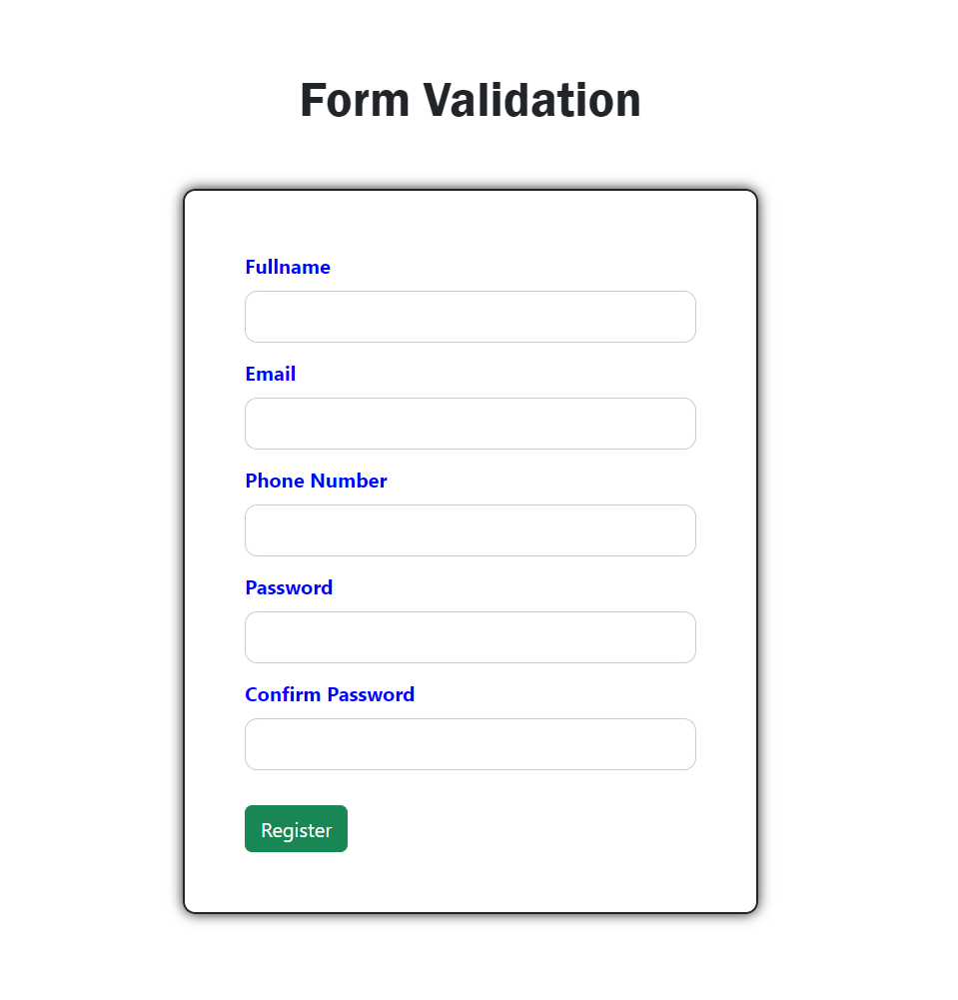
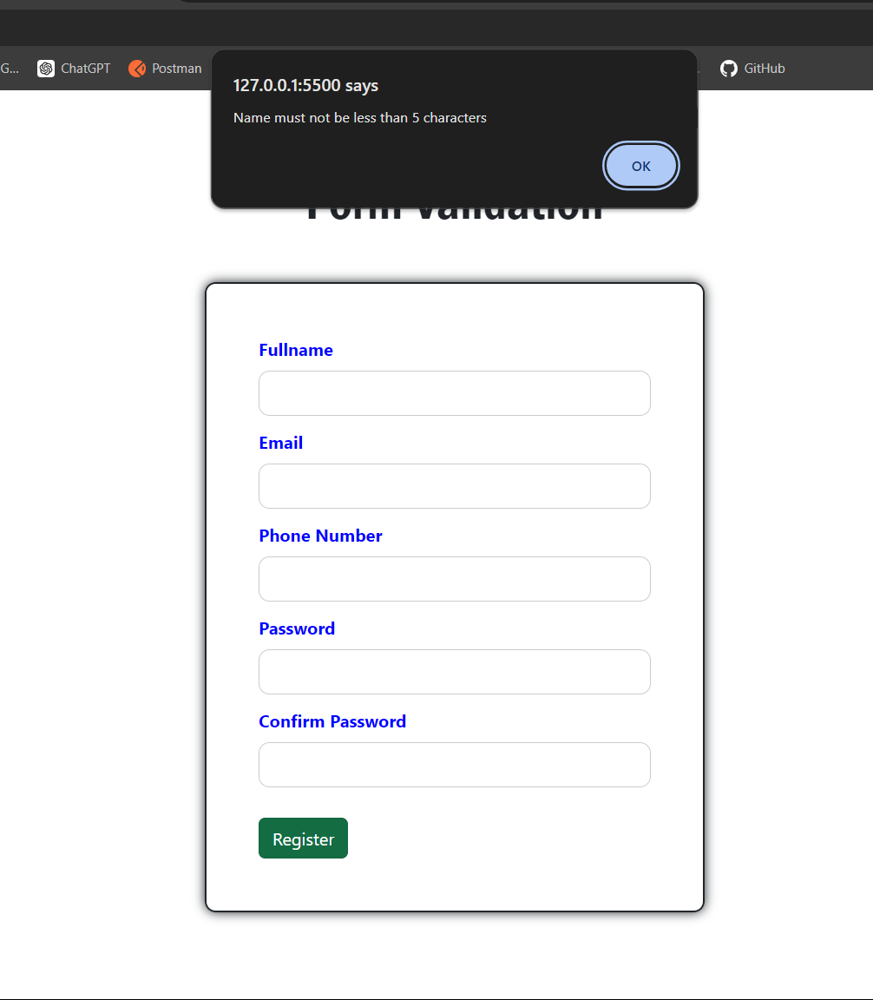

# Java Script Form Validation

A simple JavaScript form validation project that demonstrates how to validate user input using HTML, CSS, and JavaScript. This project includes real-time validation feedback for a better user experience.

## Features

- **Name Field:** Checks that the name is not empty and only contains letters more then 5 char.
- **Phone Number Field:** Validates the phone number to ensure it only contains digits and has the correct length.
- **Email Field:** Validates the email format to ensure it is correctly structured.
- **Password Field:** Ensures the password meets minimum requirements (e.g., length, special characters).
- **Confirm Password Field:** Checks that the confirm password matches the original password.

## Installation

1. To use this project, simply clone the repository:

   ```bash
   git clone https://github.com/shivadhanush1216/Java-Script-Form-Validation.git
   ```

2. Navigate to the project directory:
   ```bash
   cd Java-Script-Form-Validation
   ```

## Usage

Fill in the form fields with the required information.
Click the "Submit" button.
The form will validate the input fields and display appropriate error messages if any fields are invalid.

## Technologies Used

HTML5: Structure of the form.
CSS3: Styling of the form elements.
JavaScript: Form validation logic.

## Demo

[Live Demo](https://formvalidationbyjavascript.netlify.app/)

## Contributing

Contributions are welcome! If you have suggestions or improvements, feel free to open an issue or submit a pull request.



